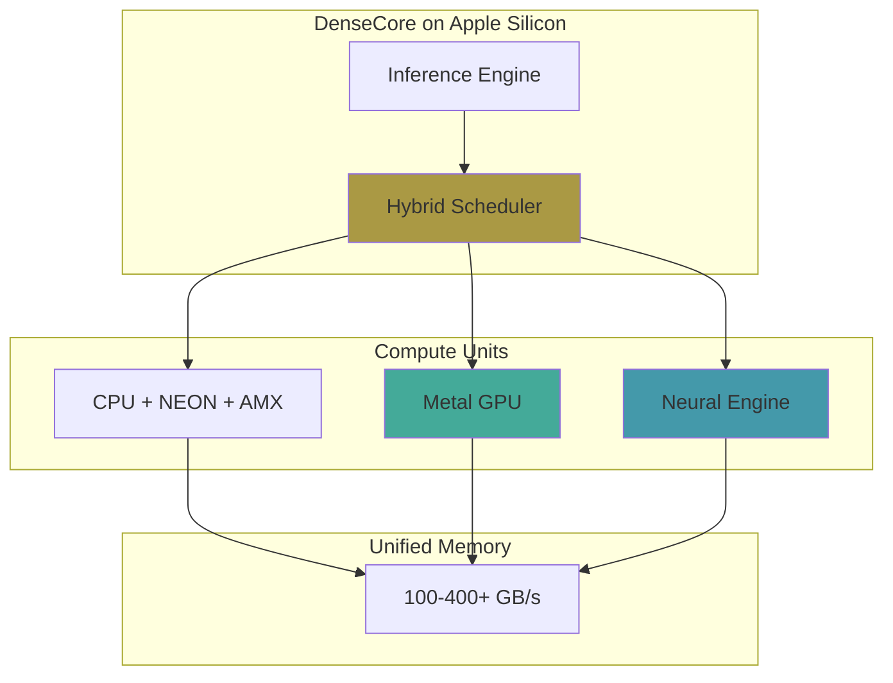

# Apple Silicon Support

DenseCore provides comprehensive support for Apple Silicon (M1, M2, M3, M4) with hardware-accelerated LLM inference using Metal GPU and Neural Engine.

---

## Overview



## Supported Chips

| Chip | GPU Cores | ANE TOPS | Memory BW | Status |
|------|-----------|----------|-----------|--------|
| **M1** | 7-8 | 11 | 68 GB/s | ✅ Supported |
| **M1 Pro/Max** | 14-32 | 11 | 200 GB/s | ✅ Supported |
| **M2** | 8-10 | 15.8 | 100 GB/s | ✅ Supported |
| **M2 Pro/Max** | 16-38 | 15.8 | 200 GB/s | ✅ Supported |
| **M3** | 10 | 18 | 100 GB/s | ✅ Supported |
| **M3 Pro/Max** | 14-40 | 18 | 300 GB/s | ✅ Supported |
| **M4** | 10 | 38 | 120 GB/s | ✅ Supported |
| **M4 Pro/Max** | 16-40 | 38 | 273 GB/s | ✅ Supported |

---

## Features

### 1. Metal GPU Backend

Custom Metal shaders optimized for LLM workloads:

- **GEMV** - SIMD-optimized vector-matrix multiplication for decode phase
- **FlashAttention** - Memory-efficient O(N) attention algorithm
- **Quantized GEMV** - Q4_0, Q4_1, Q8_0 dequantization + multiplication
- **Softmax/RMSNorm** - Fused normalization kernels

**Files:**
- `core/src/metal_backend.mm` - Metal backend implementation
- `core/shaders/gemv.metal` - GEMV kernels (FP32, FP16, INT4)
- `core/shaders/flash_attention.metal` - FlashAttention
- `core/shaders/quantized_gemv.metal` - Quantized operations

### 2. Neural Engine (ANE) Integration

CoreML-based Neural Engine acceleration:

- Pre-compiled `.mlmodelc` model loading
- FP16 optimized inference
- Automatic fallback to GPU/CPU if unsupported

**Files:**
- `core/src/ane_backend.mm` - ANE backend via CoreML
- `core/include/ane_backend.h` - ANE API

### 3. Hybrid Scheduler

Intelligent workload distribution across CPU, GPU, and ANE:

| Operation | Prefill | Decode | Best Unit |
|-----------|---------|--------|-----------|
| Embedding | CPU | CPU | Memory-bound |
| Q/K/V Projection | GPU | GPU/ANE | Compute-bound |
| Attention | GPU | GPU | Memory-bound |
| FFN Up/Down | GPU | GPU/ANE | Compute-bound |
| RMSNorm | GPU | CPU | Memory-bound |
| Sampling | CPU | CPU | Sequential |

**Thermal Adaptation:**
- Monitors system thermal state
- Shifts work from GPU to CPU/ANE on thermal pressure
- Prevents throttling during sustained inference

### 4. Unified Memory Architecture (UMA)

Zero-copy data sharing between CPU and GPU:

```cpp
// Allocations use MTLStorageModeShared
id<MTLBuffer> buffer = [device newBufferWithLength:size
                                            options:MTLResourceStorageModeShared];
// CPU and GPU access same physical memory
void* ptr = [buffer contents];
```

---

## Building on macOS

### Prerequisites

```bash
# Xcode Command Line Tools
xcode-select --install

# Optional: Ninja for faster builds
brew install ninja ccache
```

### Build

```bash
cd core
mkdir build && cd build

# Standard build
cmake .. -DCMAKE_BUILD_TYPE=Release
make -j$(sysctl -n hw.ncpu)

# With Ninja (faster)
cmake .. -G Ninja -DCMAKE_BUILD_TYPE=Release
ninja
```

### Verify Metal Backend

```bash
# Check Metal symbols
nm -gU libdensecore.dylib | grep -i metal

# Check linked frameworks
otool -L libdensecore.dylib | grep -E "(Metal|Accelerate|CoreML)"
```

---

## Usage

```python
from densecore import DenseCore

# Load model - Metal backend auto-detected on macOS ARM64
model = DenseCore(
    hf_repo_id="Qwen/Qwen3-0.6B-GGUF",
    device="AUTO"  # AUTO selects Metal on Apple Silicon
)

# Generate
for token in model.generate("The capital of France is", max_tokens=64, stream=True):
    print(token, end="", flush=True)
```

### Force Specific Backend

```python
# Force Metal GPU
model = DenseCore(..., device="GPU")

# Force CPU (with AMX)
model = DenseCore(..., device="CPU")

# Force ANE (requires cached CoreML models)
model = DenseCore(..., device="ANE")
```

---

## Metal Shader Compilation

Metal shaders are compiled to `.metallib` at build time:

```bash
# Shaders are automatically compiled by CMake
ls build/densecore.metallib

# Manual compilation
xcrun -sdk macosx metal -c core/shaders/*.metal -o core.air
xcrun -sdk macosx metallib core.air -o densecore.metallib
```

---

## Performance Tips

### 1. Use Quantized Models

Quantized models are faster due to lower memory bandwidth requirements:

```python
# Recommended for Apple Silicon
model = DenseCore(hf_repo_id="Qwen/Qwen3-4B-GGUF", quantization="Q4_K_M")
```

### 2. Set Thread Count

Tune thread count for your P-core count:

```python
import os
os.environ["DENSECORE_N_THREADS"] = "8"  # Match P-core count
```

### 3. Enable Efficiency Mode for Battery

```python
# Prefer CPU/ANE over GPU for lower power consumption
model = DenseCore(..., prefer_efficiency=True)
```

---

## Debugging

### GPU Capture

Enable Metal GPU capture for profiling:

```cpp
MetalBackend backend;
backend.EnableGPUCapture("/path/to/capture.gputrace");
// ... run inference ...
backend.DisableGPUCapture();
```

Then open `capture.gputrace` in Xcode for detailed analysis.

### Thermal Monitoring

```bash
# Monitor thermal state
sudo powermetrics --samplers thermal
```

---

## Architecture Details

### File Structure

```
core/
├── include/
│   ├── apple_silicon.h      # Chip detection utilities
│   ├── metal_backend.h      # Metal GPU backend interface
│   ├── ane_backend.h        # Neural Engine interface
│   └── hybrid_scheduler.h   # CPU/GPU/ANE coordination
├── src/
│   ├── apple_silicon.mm     # sysctl/IOKit chip detection
│   ├── metal_backend.mm     # Metal implementation
│   ├── ane_backend.mm       # CoreML implementation
│   └── hybrid_scheduler.mm  # Scheduling logic
└── shaders/
    ├── gemv.metal           # FP32/FP16/INT4 GEMV
    ├── flash_attention.metal # FlashAttention
    └── quantized_gemv.metal  # Q4/Q8 dequant + GEMV
```

### Chip Detection

```cpp
#include "apple_silicon.h"

auto chip = apple::DetectChipGeneration();  // M1, M2, M3, M4...
int tops = apple::GetNeuralEngineTOPS();    // 11-38
bool amx = apple::HasAMX();                 // true on all Apple Silicon
```

---

## Frequently Asked Questions

### Q: Why is my model not using the Neural Engine?

ANE requires pre-compiled CoreML models (`.mlmodelc`). Runtime compilation is too slow. Use coremltools to generate models offline:

```python
import coremltools as ct
# ... create model ...
model.save("layer.mlpackage")
# Then: xcrun coremlcompiler compile layer.mlpackage ./cache
```

### Q: GPU vs CPU - which is faster?

- **Prefill (large batch)**: GPU is faster
- **Decode (batch=1)**: GPU and CPU are competitive; GPU slightly faster for large models

### Q: How do I check if Metal is being used?

```python
from densecore import DenseCore
model = DenseCore(...)
print(model.backend_name)  # "Apple-Metal-M3" or similar
```

---

## References

- [Metal Best Practices Guide](https://developer.apple.com/library/archive/documentation/3DDrawing/Conceptual/MTLBestPracticesGuide/)
- [CoreML Documentation](https://developer.apple.com/documentation/coreml)
- [Apple Silicon GPU Counter Guide](https://developer.apple.com/documentation/metal/gpu_counters_and_counter_sample_buffers)
