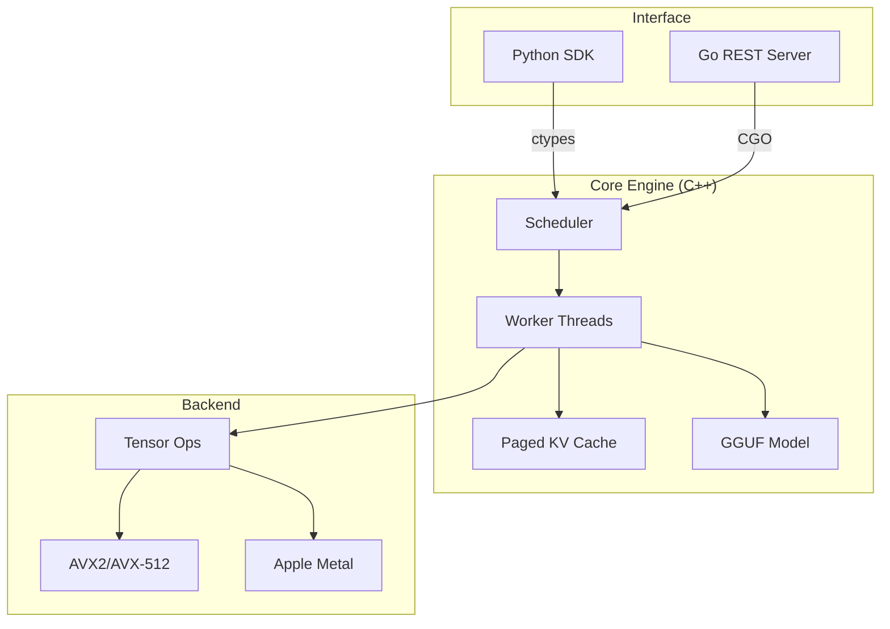

# Architecture

DenseCore is a hybrid C++/Python/Go system designed for high-efficiency LLM inference on CPU.

## System Overview

## Key Components

### 1. C++ Core (`core/src/`)
The inference engine is written in C++17, handling:
- **Model Loading**: Memory-mapped GGUF loading via `model_loader.cpp`.
- **Scheduling**: Continuous batching of requests in `worker.cpp`.
- **Memory Management**: Block-based Paged KV Cache (`kv_cache.cpp`) to minimize fragmentation.
- **Compute**: Dispatches matrix operations to architecture-specific backends (AVX2/AVX-512 for x86, Metal for macOS).

### 2. Python SDK (`python/densecore/`)
A thin wrapper around the C++ library using `ctypes`.
- Direct memory access to C++ structures where possible.
- Async support via a dedicated background thread for callbacks.
- Handles model downloading (HuggingFace Hub) and configuration.

### 3. Go Server (`server/`)
Provides an OpenAI-compatible REST API.
- Uses CGO to link directly against `libdensecore`.
- Capabilities: SSE streaming, tiered rate limiting, and Prometheus metrics.

## Memory Management

### Paged KV Cache
Inspired by vLLM, DenseCore uses non-contiguous memory blocks for the Key-Value cache.
- **Blocks**: Each block holds tokens for a fixed size (e.g., 16 tokens).
- **Allocation**: Blocks are allocated on-demand, reducing wasted memory for short sequences.
- **Sharing**: Enables efficient memory sharing.

### Arena Allocator
Temporary tensor computations (activations) use a bump-pointer arena allocator, reset after each forward pass. This eliminates `malloc`/`free` overhead during generation.

## Performance Optimizations

- **Intelligent Batching**: Requests are processed in batches when possible, maximizing SIMD throughput.
- **Graph Caching**: Computation graphs are reused between tokens to reduce overhead.
- **Quantization**: Native support for GGML quantization types (Q4_K_M, Q8_0).
- **Hybrid Backend**: On macOS, heavy matrix multiplications offload to Metal GPU, while smaller ops run on CPU to minimize latency.
