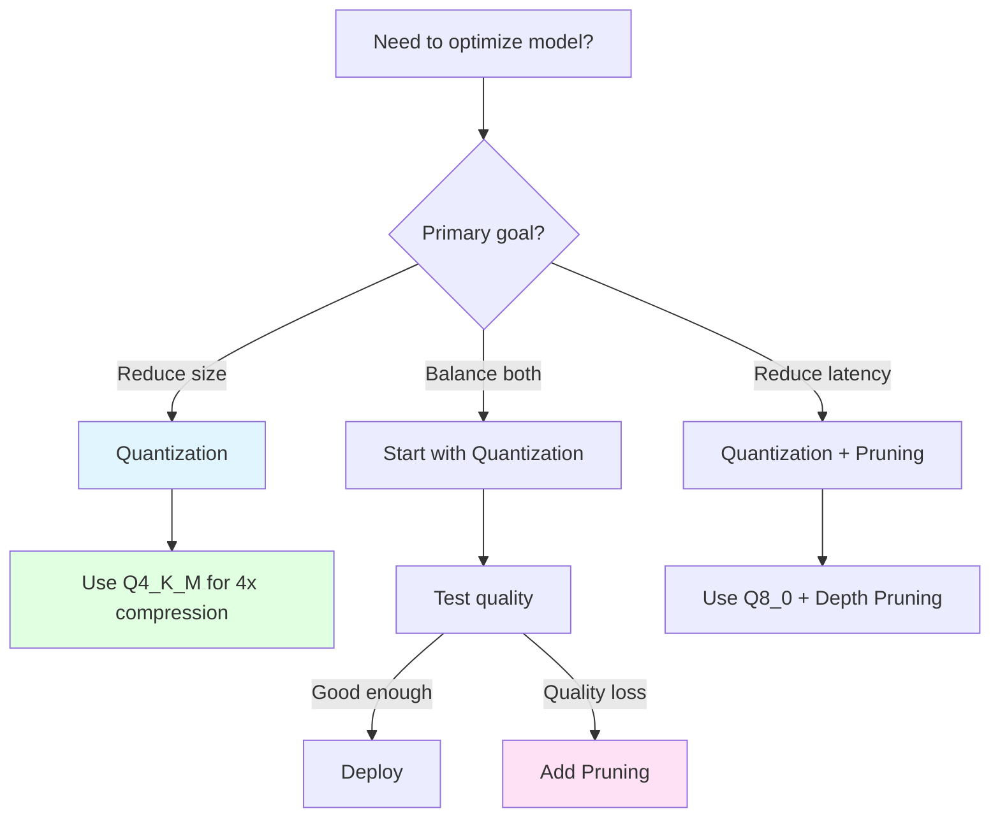

# Model Optimization Guide

Learn how to compress and accelerate your models using DenseCore's quantization and pruning capabilities.

---

## Table of Contents

- [Overview](#overview)
- [Quantization](#quantization)
- [Pruning](#pruning)
- [Performance Benchmarks](#performance-benchmarks)
- [Best Practices](#best-practices)
- [Troubleshooting](#troubleshooting)

---

## Overview

DenseCore supports two primary model optimization techniques:

| Technique | Size Reduction | Speed Gain | Quality Impact | Use Case |
|-----------|----------------|------------|----------------|----------|
| **Quantization** | 2-8x | 1.5-3x | Low (2-5%) | Production deployment |
| **Pruning** | 1.5-2x | 1.3-2x | Medium (5-10%) | **EXPERIMENTAL** |
| **Combined** | 3-16x | 2-5x | Medium (7-15%) | **EXPERIMENTAL** |

### When to Use Each



---

## Quantization

Quantization reduces the precision of model weights from FP16/FP32 to INT4/INT8, dramatically reducing memory usage and improving inference speed.

### Supported Formats

DenseCore uses GGML's proven K-quant formats:

| Format | Bits | Size | Speed | Quality | Use Case |
|--------|------|------|-------|---------|----------|
| **Q4_K_M** | 4-bit | ~4x smaller | 2-3x faster | ~5% loss | Recommended for most use cases |
| **Q5_K_M** | 5-bit | ~3x smaller | 1.8-2x faster | ~3% loss | Higher quality requirement |
| **Q8_0** | 8-bit | ~2x smaller | 1.5x faster | ~2% loss | Quality-critical applications |
| **Q4_0** | 4-bit | ~4x smaller | 2-3x faster | ~7% loss | Maximum speed, basic quality |

#### Q4_K_M (Recommended)

**Best for:** Maximum compression with acceptable quality loss

```python
from densecore.quantize import Q4_K_M_CFG, quantize_model

quantize_model(
    input_path="qwen-7b-fp16.gguf",
    output_path="qwen-7b-q4km.gguf",
    config=Q4_K_M_CFG  # 4-bit K-quants with medium accuracy
)
```

**Specs:**
- **Compression:** 4x (7B model: 14GB → 3.5GB)
- **Speed:** 2-3x faster inference
- **Quality:** ~5% perplexity increase
- **Method:** Block-wise K-quant with adaptive scaling

#### Q8_0 (High Quality)

**Best for:** Conservative compression with minimal quality loss

```python
from densecore.quantize import Q8_0_CFG, quantize_model

quantize_model(
    input_path="model-fp16.gguf",
    output_path="model-q8.gguf",
    config=Q8_0_CFG  # 8-bit symmetric quantization
)
```

**Specs:**
- **Compression:** 2x (7B model: 14GB → 7GB)
- **Speed:** 1.5-2x faster
- **Quality:** ~2% perplexity increase

#### Q5_K_M (Balanced)

**Best for:** Balance between compression and quality

```python
from densecore.quantize import Q5_K_M_CFG, quantize_model

quantize_model(
    input_path="model-fp16.gguf",
    output_path="model-q5km.gguf",
    config=Q5_K_M_CFG
)
```

**Specs:**
- **Compression:** 3x
- **Speed:** 1.8-2.5x faster
- **Quality:** ~3% perplexity increase

### How GGML K-Quants Work

GGML's K-quant formats achieve high quality through:

1. **Adaptive Block-Level Scaling:** Each block of 32/64 weights has its own scaling factor
2. **Super-Block Structure:** Groups of blocks share additional metadata for better accuracy
3. **Importance-Weighted Rounding:** Minimizes quantization error through optimal rounding

> [!IMPORTANT]
> **Experimental Status**: "Width Pruning" and "Combined Optimization" are currently **EXPERIMENTAL**. They may result in significant quality degradation or unexpected behavior. We currently recommend using **Quantization only (Q4_K_M)** for production workloads.

> **Note on AWQ/SmoothQuant**: True AWQ and SmoothQuant algorithms require specific kernel support which is currently **NOT** implemented in the CPU inference engine. While the quantizer can process these formats, they will not provide speedups and may degrade quality compared to standard GGML K-quants. We strongly recommend using **GGML K-quants (Q4_K_M, Q8_0)** instead.

### Step-by-Step Guide

#### 1. Convert HuggingFace Model to GGUF

If starting from a HuggingFace model:

```bash
# Install converter
pip install transformers torch

# Convert to FP16 GGUF
python -m densecore.convert \
  --model-id Qwen/Qwen2.5-7B-Instruct \
  --output qwen-7b-fp16.gguf \
  --dtype fp16
```

See [HuggingFace to GGUF Guide](HF_TO_GGUF.md) for details.

#### 2. Choose Quantization Format

Decision tree:

```
Model size > 7B?
  └─ Yes → Use Q4_K_M (best compression)
  └─ No  → Use Q8_0 (best quality)

Quality critical?
  └─ Yes → Q5_K_M or Q8_0
  └─ No  → Q4_K_M

Memory constrained?
  └─ Yes → Q4_K_M
  └─ No  → Q5_K_M or Q8_0
```

#### 3. Run Quantization

```python
from densecore.quantize import quantize_model, Q4_K_M_CFG

result = quantize_model(
    input_path="qwen-7b-fp16.gguf",
    output_path="qwen-7b-q4km.gguf",
    config=Q4_K_M_CFG,
    verbose=True
)

print(f"Original size: {result.input_size_mb:.2f} MB")
print(f"Quantized size: {result.output_size_mb:.2f} MB")
print(f"Compression ratio: {result.compression_ratio:.2f}x")
```

#### 4. Validate Quality

```python
from densecore import DenseCore

# Load original and quantized models
original = DenseCore("qwen-7b-fp16.gguf")
quantized = DenseCore("qwen-7b-q4km.gguf")

# Test prompts
test_prompts = [
    "Explain quantum physics in simple terms.",
    "Write a Python function to reverse a string.",
    "What is the capital of France?"
]

for prompt in test_prompts:
    orig_response = original.generate(prompt, max_tokens=50)
    quant_response = quantized.generate(prompt, max_tokens=50)
    
    print(f"Prompt: {prompt}")
    print(f"Original:  {orig_response[:100]}...")
    print(f"Quantized: {quant_response[:100]}...")
    print()
```

#### 5. Benchmark Performance

```python
import time
from densecore import DenseCore

model = DenseCore("qwen-7b-q4km.gguf")

prompt = "Once upon a time" * 20  # Long prompt
start = time.time()
response = model.generate(prompt, max_tokens=200)
elapsed = time.time() - start

tokens_generated = 200
tps = tokens_generated / elapsed
print(f"Throughput: {tps:.2f} tokens/second")
```

---

## Pruning

Pruning removes unnecessary model parameters (layers, attention heads, neurons) to reduce model size and computational cost.

> [!WARNING]
> **EXPERIMENTAL FEATURE**: Pruning logic is currently in **Beta**. The "Width Pruning" and "Combined" strategies are not yet fully optimized for the inference engine and may result in **severe quality loss**. We recommend using **Quantization** instead for reliable acceleration.

### Pruning Strategies

#### Depth Pruning (Layer Removal)

Remove entire transformer layers based on importance:

```python
from densecore.prune import DEPTH_PRUNE_50_CFG, prune_model

# Remove 50% of layers (e.g., 32 → 16 layers)
prune_model(
    input_path="llama-7b.gguf",
    output_path="llama-3.5b-pruned.gguf",
    config=DEPTH_PRUNE_50_CFG
)
```

**How it works:**
1. Compute importance score for each layer (L1 norm of weights)
2. Rank layers by importance
3. Remove bottom 50% of layers
4. Update model metadata (n_layers)

#### Width Pruning (Dimension Reduction)

Reduce `hidden_size` and `ffn_hidden_size`:

```python
from densecore.prune import PruneConfig

# Reduce dimensions by 25%
config = PruneConfig(
    strategy="width",
    target_hidden_size=3072,     # Original: 4096
    target_ffn_size=8192,        # Original: 11008
    importance_method="magnitude"
)

prune_model("llama-7b.gguf", "llama-5b-width.gguf", config)
```

> **Note:** Width pruning implementation is in progress. Depth pruning is production-ready.

### Predefined Configurations

```python
from densecore.prune import (
    DEPTH_PRUNE_25_CFG,  # Remove 25% of layers
    DEPTH_PRUNE_50_CFG,  # Remove 50% of layers
)

# Quick pruning
prune_model("model.gguf", "model-pruned.gguf", DEPTH_PRUNE_25_CFG)
```

---

## Performance Benchmarks

### Quantization Performance

**Model:** Qwen2.5-7B  
**Hardware:** Intel i7-10870H (8 cores), 16GB RAM

| Format | Size | TPS (Short) | TPS (Long) | Perplexity ↑ |
|--------|------|-------------|------------|--------------|
| FP16 (Baseline) | 14.0 GB | 8.2 | 6.1 | 0.0% |
| Q8_0 | 7.0 GB | 12.5 (+52%) | 9.3 (+52%) | +2.1% |
| Q5_K_M | 5.3 GB | 15.1 (+84%) | 11.8 (+93%) | +3.2% |
| Q4_K_M | 3.5 GB | 18.7 (+128%) | 14.2 (+133%) | +4.8% |
| Q4_0 | 3.5 GB | 18.9 (+130%) | 14.5 (+138%) | +7.2% |

**Key Insights:**
- Q4_K_M maintains much better quality than Q4_0
- Q8_0 is a sweet spot for quality-critical applications
- Speed improvements scale linearly with compression ratio

### Pruning Performance

**Model:** Llama-2-7B (32 layers)  
**Method:** Depth pruning (magnitude-based)

| Config | Layers | Size | TPS | Perplexity ↑ |
|--------|--------|------|-----|--------------|
| Original | 32 | 13.0 GB | 7.5 | 0.0% |
| 25% Pruned | 24 | 9.8 GB | 9.7 (+29%) | +3.2% |
| 50% Pruned | 16 | 6.5 GB | 11.8 (+57%) | +8.7% |

### Combined Optimization

**Model:** Llama-2-7B  
**Strategy:** Depth pruning 50% + Q4_K_M quantization

| Metric | Original | Optimized | Change |
|--------|----------|-----------|--------|
| **Size** | 13.0 GB | 1.6 GB | **8.1x smaller** |
| **TPS (Decode)** | 7.5 | 22.4 | **3.0x faster** |
| **Perplexity** | 5.68 | 6.42 | +13% |

---

## Best Practices

### 1. **Start with Quantization**

Always quantize before pruning:

```
Raw Model → Quantize → (Optionally Prune) → Deploy
```

**Reason:** Quantization is lossless in terms of model structure, while pruning is destructive.

### 2. **Validate on Your Task**

Generic benchmarks (perplexity, MMLU) may not reflect your use case:

```python
# Define task-specific evaluation
def evaluate_on_task(model_path):
    model = DenseCore(model_path)
    scores = []
    
    for example in your_test_set:
        response = model.generate(example.prompt)
        score = compute_task_metric(response, example.expected)
        scores.append(score)
    
    return sum(scores) / len(scores)

# Compare
print(f"FP16 score: {evaluate_on_task('model-fp16.gguf')}")
print(f"Q4_K_M score: {evaluate_on_task('model-q4km.gguf')}")
```

### 3. **Use Q4_K_M for Production**

For most applications, Q4_K_M offers the best quality/size tradeoff:

```python
# ✅ Recommended for production
from densecore.quantize import Q4_K_M_CFG

quantize_model("model.gguf", "model-q4km.gguf", Q4_K_M_CFG)
```

### 4. **Monitor Memory Usage**

Quantization reduces RAM requirements significantly:

```python
import psutil
from densecore import DenseCore

# Before loading
mem_before = psutil.virtual_memory().used / 1e9

model = DenseCore("qwen-7b-q4km.gguf")

# After loading
mem_after = psutil.virtual_memory().used / 1e9
print(f"Model memory: {mem_after - mem_before:.2f} GB")
```

**Expected:**
- FP16: ~14 GB
- Q8_0: ~7 GB
- Q4_K_M: ~3.5 GB

---

## Troubleshooting

### Quantization Issues

#### "Quantized model produces garbage output"

**Cause:** Quantization tolerance is too aggressive for your model.

**Solution:** Use Q5_K_M or Q8_0 instead of Q4_K_M:

```python
# Try Q5_K_M or Q8_0 for better quality
quantize_model("model.gguf", "model-q8.gguf", Q8_0_CFG)
```

#### "Out of memory during quantization"

**Cause:** Model is too large for available RAM.

**Solution:** Use a cloud instance with more RAM, or quantize in chunks.

### Pruning Issues

#### "Pruned model has dramatically lower quality"

**Cause:** Pruned too aggressively.

**Solution:** Use a smaller pruning ratio:

```python
# Instead of 50%
config = DEPTH_PRUNE_50_CFG

# Try 25%
config = DEPTH_PRUNE_25_CFG
```

---

## Roadmap

### Upcoming Features

- [ ] **Width Pruning:** Reduce hidden dimensions
- [ ] **Attention Pruning:** Remove unnecessary attention heads
- [ ] **Knowledge Distillation:** Train small model to mimic large one
- [ ] **Mixed Precision:** Q4_K for some layers, Q8_0 for others

### Request a Feature

Have a specific optimization technique in mind? [Open an issue](https://github.com/Jake-Network/DenseCore/issues) or contribute!

---

## References

- [GGML Quantization Types](https://github.com/ggerganov/llama.cpp/wiki/Feature-matrix)
- [Minitron: Depth/Width Pruning](https://arxiv.org/abs/2407.14679)
- [GPTQ: Accurate Quantization](https://arxiv.org/abs/2210.17323)

---

**Next Steps:**
- [Deploy Optimized Models](DEPLOYMENT.md)
- [Architecture Deep Dive](ARCHITECTURE.md)
- [API Reference](API_REFERENCE.md)
